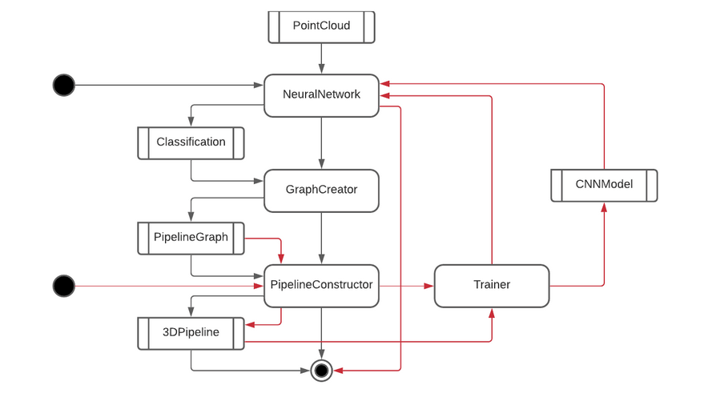
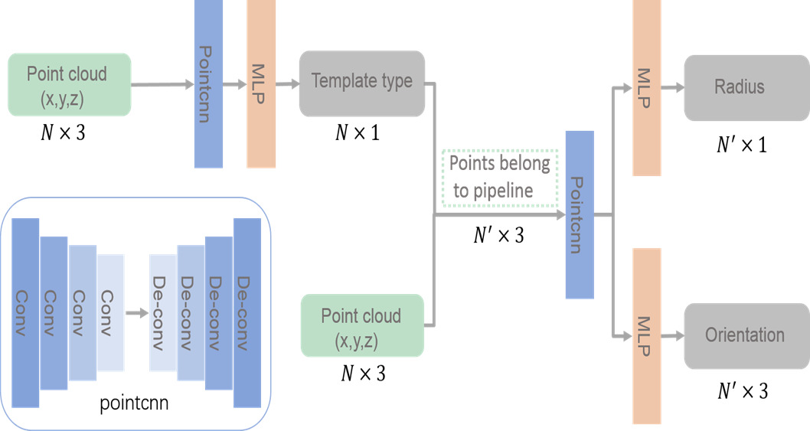

# PyPipes

**[Documentation]()** | **[Paper](https://doi.org/10.1016/j.gmod.2020.101079)** | **[Colab Notebooks](https://drive.google.com/drive/folders/1InpU4yZAYGR9_NB4wSGDx7t2d6K2b9zy?usp=sharing)** | **[Video Tutorials](https://www.youtube.com)** | **[Master Degree website](https://departement-informatique.univ-tlse3.fr/master-igai/)** 

### [WARNING] Project currently in progress !

**This project** is a [PyTorch](https://pytorch.org/) implementation of *DeepPipes: Learning 3D pipelines reconstruction from point clouds. Lili Cheng, Zhuo Wei, Mingchao Sun, Shiqing Xin, Andrei Sharf, Yangyan Li, Baoquan Chen, Changhe Tu. Graphical Models, Volume 111, 2020,*. 

It allows to reconstruct a 3d pipe model from a points cloud.


```
#### Abstract

Pipes are the basic building block in many industrial sites like electricity and chemical plants. Although
pipes are merely cylindrical primitives which can be defined by axis and radius, they often consist of
additional components like flanges, valves, elbows, tees, etc. 3D pipes are typically dense, consisting of a
wide range of topologies and geometries, with large self-occlusions. Thus, reconstruction of a coherent 3D pipe
models from large-scale point clouds is a challenging problem. In this work we take a prior-based
reconstruction approach which reduces the complexity of the general pipe reconstruction problem into a
combination of part detection and model fitting problems. We utilize convolutional network to learn point cloud
features and classify points into various classes, then apply robust clustering and graph-based aggregation
techniques to compute a coherent pipe model. Our method shows promising results on pipe models with varying
complexity and density both in synthetic and real cases.

Keywords: Point cloud, Pipes reconstruction, Convo-
lution network, Skeleton extraction

```

## Table of Contents

#### 1. [Architecture Overview](https://github.com/ZENULI/PyPipes#architecture-overview)
* [The pipeline](https://github.com/ZENULI/PyPipes#the-pipeline)
* [Neural Network](https://github.com/ZENULI/PyPipes#neural-network)

#### 2. [Download](https://github.com/ZENULI/PyPipes#download)
* [Requirements](https://github.com/ZENULI/PyPipes#requirements)
* [From master](https://github.com/ZENULI/PyPipes#from-master)
* [With Docker](https://github.com/ZENULI/PyPipes#with-docker)

#### 3. [Getting Started](https://github.com/ZENULI/PyPipes#getting-started)

#### 4. [License](https://github.com/ZENULI/PyPipes#license)

<br>

## Architecture Overview

### The pipeline

```
**TODO**
```




### Neural Network 

```
**TODO**
```



## Download

**Warning:** We do not recommend installation of the environnement as a root user on your system Python. Please setup a virtual environment or create a Docker image.

|             | `cpu` | `cu102` | `cu113` |
|-------------|-------|---------|---------|
| **Linux**   | ✅    |         |         |
| **Windows** |       |         |         |
| **macOS**   |       |         |         |

### Requirements

```
**TODO**
```

### From master

#### 1. Clone the repositories
```bash
$ git clone https://github.com/ZENULI/PyPipes.git
```
#### 2. Build the project
```bash
$ cd PyPipes
$ make
$ python setup.py build
$ python setup.py install
```

#### 2. Testing

```bash
$ python3 setup.py test
```
You can find some more tests under the `testing/` folder!

```bash
$  pytest testing/test_application.py
```

### From Docker

See documentation [here](https://github.com/ZENULI/PyPipes/tree/main/docker).

## Getting Started 


#### 1. Generate the dataset

You can generate the dataset using our other project [CloudPipesGenerator](https://github.com/ZENULI/CloudPipesGenerator)

```bash
$ mkdir data
$ python3 PATH_TO_CLOUDPIPESGENERATOR/generate_dataset.py -n 5000 -m 4 /data
```

###### Or download our dataset online
If you do not want to generate the dataset, you can download our own. 

```bash
$ chmod +x download.sh
$ ./download.sh
```

#### 2. Preprocessing

```bash
$ python build_vocab.py   
$ python resize.py
```

#### 3. Train the model

```bash
$ python train.py    
```

###### Or use our pretrained model
If you do not want to train the model from scratch, you can use a pretrained model. You can download the pretrained model [here](https://www.dropbox.com/s/ne0ixz5d58ccbbz/pretrained_model.zip?dl=0) and the vocabulary file [here](https://www.dropbox.com/s/26adb7y9m98uisa/vocap.zip?dl=0). You should extract pretrained_model.zip to `./models/` and vocab.pkl to `./data/` using `unzip` command.


#### 4. Test the model 

```bash
$ python sample.py --image='png/example.png'
```

## License


MIT License Copyright (c) 2022 ZENULI

Created by ZENULI at University Paul Sabatier III :
#### https://github.com/BastienKovac
#### https://github.com/Ulynor
#### https://github.com/seb2s


