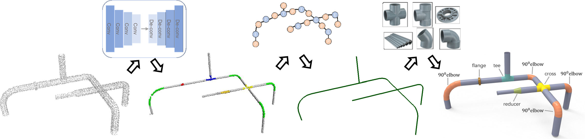
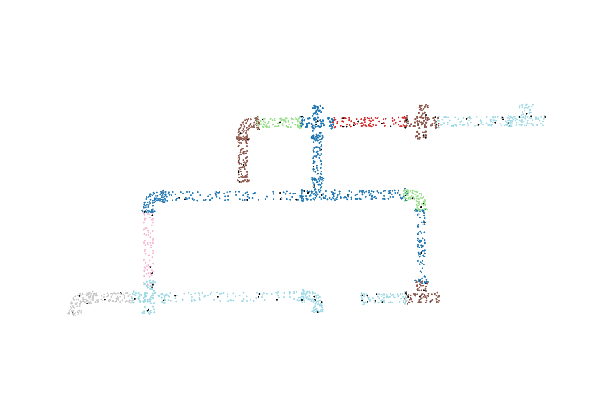
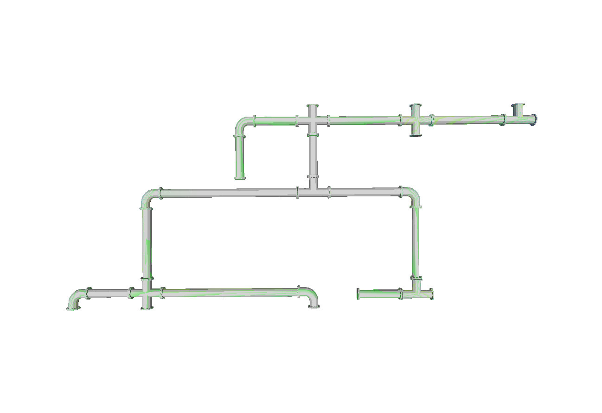
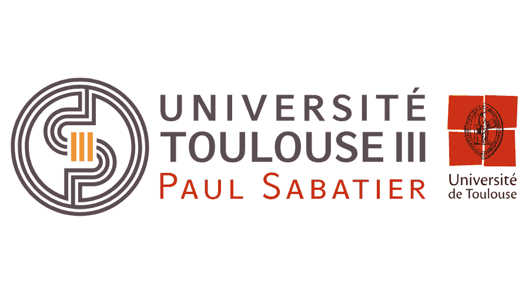

# PyPipes

**[Paper](https://doi.org/10.1016/j.gmod.2020.101079)** | **[Master Degree website](https://departement-informatique.univ-tlse3.fr/master-igai/)** 


**This project** is a [PyTorch](https://pytorch.org/) implementation of *DeepPipes: Learning 3D pipelines reconstruction from point clouds. Lili Cheng, Zhuo Wei, Mingchao Sun, Shiqing Xin, Andrei Sharf, Yangyan Li, Baoquan Chen, Changhe Tu. Graphical Models, Volume 111, 2020,*. 

It allows to reconstruct a 3d pipe model from a points cloud.





```
#### Abstract

Pipes are the basic building block in many industrial sites like electricity and chemical plants. Although
pipes are merely cylindrical primitives which can be defined by axis and radius, they often consist of
additional components like flanges, valves, elbows, tees, etc. 3D pipes are typically dense, consisting of a
wide range of topologies and geometries, with large self-occlusions. Thus, reconstruction of a coherent 3D pipe
models from large-scale point clouds is a challenging problem. In this work we take a prior-based
reconstruction approach which reduces the complexity of the general pipe reconstruction problem into a
combination of part detection and model fitting problems. We utilize convolutional network to learn point cloud
features and classify points into various classes, then apply robust clustering and graph-based aggregation
techniques to compute a coherent pipe model. Our method shows promising results on pipe models with varying
complexity and density both in synthetic and real cases.

Keywords: Point cloud, Pipes reconstruction, Convo-
lution network, Skeleton extraction

```
<br>

## Getting Started 

**Warning:** We do not recommend installation of the environnement as a root user on your system Python. Please setup a virtual environment or create a Docker image.

Not tested on macOS. 

|             | `cpu` | `cu102` | `cu113` |
|-------------|-------|---------|---------|
| **Linux**   | ✅    |  ✅     |         |
| **Windows** | ✅    |  ✅     |         |
| **macOS**   |       |         |         |


#### Generate the dataset
```bash
$ python scripts/generate_data_samples.py
```
#### Train the model

###### [WARNING] This part is currently in progress !

#### Run the pipeline
```bash
$ python scripts/reconst.py 
```

## Some results 


DBscan clustering
<br>

3D reconstruction of the model

## License

Pypipes is available as open source under the terms of the [MIT License](http://opensource.org/licenses/MIT).

It was created by ZENULI's team at University Paul Sabatier III : 
* https://github.com/BastienKovac
* https://github.com/Ulynor
* https://github.com/seb2s


